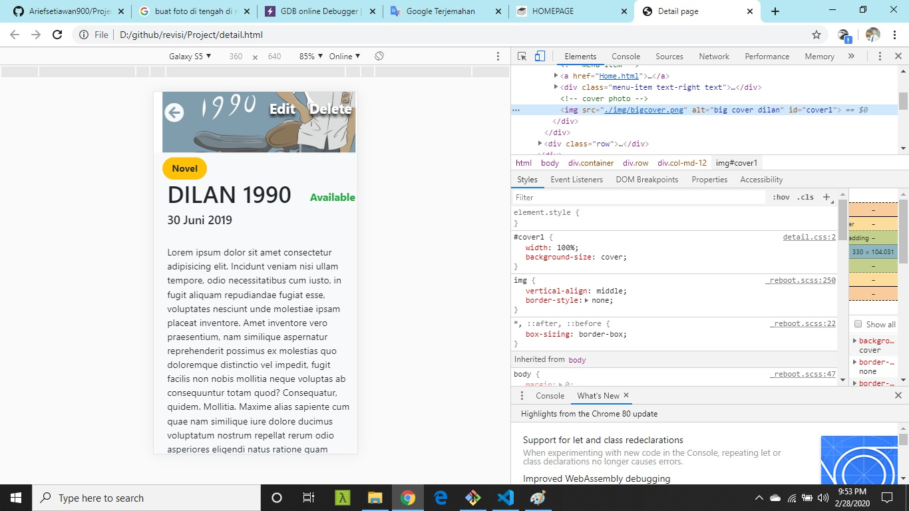
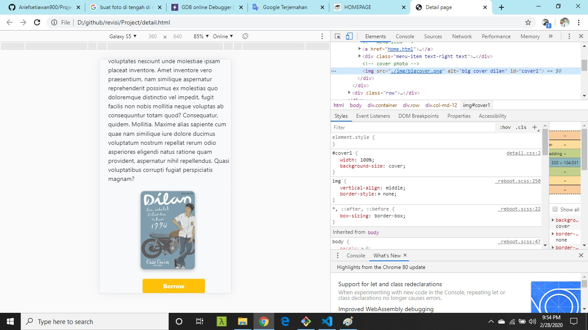
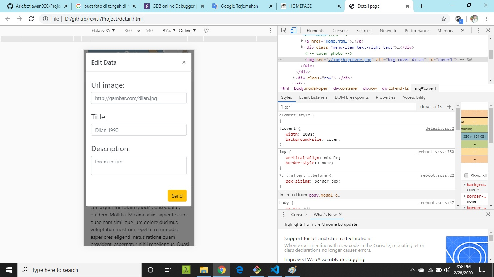
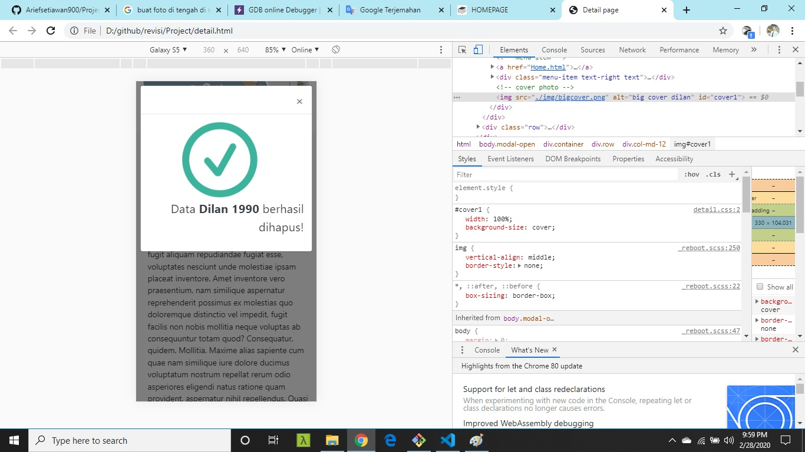

<h1>Continue Assignments/project week1</h1>
<h2>By : Arief Setiawan(arief.setiawan8788@gmail.com)</h2>

Reference My Assignments : https://www.figma.com/file/Mj3THivoX0IaTPEZ4vJZoajw/Books?node-id=1%3A45

<h3><a href="index.html">1. Index.html or first look by login page</a> </h3>
</img>
<h3>Login page with responsive</h3>
</img>
 
<h3>2. Register.html  first look</h3>
</img>
<h3>Register page with responsive</h3>

</img>
 
<h3>3. Home.html first look </h3>
</img>
<h3>Home page no use sidebar</h3>
</img>
<h3>Modal with boostrap</h3>
</img>

<h3>Home page responsive</h3>
</img>
<h3>Home page responsive with sidebar</h3>
</img>
<h3>Modal home responsive</h3>
</img>
 
<h3>4. Detail .html first look </h3>
</img>
<h3>Modal Edit data with boostrapk </h3>
</img>
<h3>Modal delete with boostrap </h3>
</img>

<h3>4. Detail.html responsive top </h3>
</img>
<h3>Detail .html responsive bottom with bootrap</h3>
</img>
<h3>Detail responsive modal edit data with boostrap</h3>
</img>
<h3>Detail responsive modal delete with boostrap</h3>
</img>

